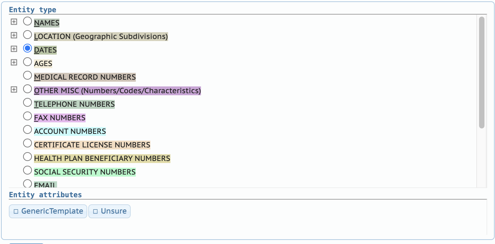

<!--

author:   Rose Hartman
email:    hartmanr1@chop.edu
version: 4.2.0
logo: https://upload.wikimedia.org/wikipedia/commons/thumb/a/ae/20210304191333_IMG_3364-01.jpg/512px-20210304191333_IMG_3364-01.jpg?20210325173111
language: en
narrator: UK English Female
mode: Textbook
title: Annotation Guidelines

comment:  This is the full description of the ontology used to annotate identifying information in clinical notes for Arcus Projects. 

import: https://raw.githubusercontent.com/arcus/education_modules/main/_module_templates/macros.md

@highlight: <b style="background-color: rgba(var(--color-highlight), .2)">@0</b>
-->

# Annotation Guidelines

**Who this is for:** 
This is the annotation guidelines to be used by human coders who will be checking the annotations produced by NLP (natural language processing) models. 
The annotations are an attempt to find identifying information in clinical notes. 

**What this covers:**
This document is a full description of the ontology used to code notes, with definitions and examples for each category.  

## Key terms

**Document**: 
A document is a single note in a patient's electronic health record. 
When you open the brat annotation tool, it will display one document (note) at a time.

**Span**: 
A span is a single continuous piece of a note. 
It may be a single word, or a part of a word, or it may contain several words in a row. 

**Label**: 
The labels are the categories of information we want to identify within the notes. 
For example, patient name (PATIENT) is one label, and zip code (ZIPCODE) is another. 

**Annotation**: 
Creating an annotation means highlighting a span in the text, and then associating that span with a label. 
For example, consider the following fake note: "Raul presents with fever that doesn't respond to tylenol as well as cough, congestion, and fatigue." 
We would create an annotation in this note which would be the span "Raul" and it would get the label "PATIENT".
You also have the option to add additional information about an annotation, by clicking [Unsure](#unsure) or [GenericTemplate](#generictemplate) and/or by writing a note in the annotation notes box.

**HIPAA**: 
[Health Insurance Portability and Accountability Act](https://www.hhs.gov/hipaa/for-professionals/index.html). 
This is a law in the United States that protects certain health information, establishing strict rules around the use and disclosure of PHI. 

**PHI**: 
Protected Health Information. 
PHI is a specific term for the kind of information that is protected by the [HIPAA Privacy Rule](https://www.hhs.gov/hipaa/for-professionals/privacy/index.html). 
PHI is "individually identifiable health information".

## General tips

<div class = "learn-more">
<b style="color: rgb(var(--color-highlight));">Distinguish health information from identity information</b><br>

HIPAA protects PHI, but health information that's not linkable to any individual person (de-identified) is not protected. 
The goal when de-identifying clinical data is to remove or mask all of the information that could be used to *identify* who the note is about (and [HIPAA provides specific guidance](https://www.hhs.gov/hipaa/for-professionals/privacy/special-topics/de-identification/index.html) about this) while keeping as much of the *health* information as possible.

</div>

<div class = "version-update">
<b style="color: rgb(var(--color-highlight));">HIPAA is the baseline</b><br>

You may be familiar already with the [18 categories of identifying information listed under the HIPAA safe harbor method](https://www.hhs.gov/hipaa/for-professionals/privacy/special-topics/de-identification/index.html#safeharborguidance). 
Most of the text you'll be annotating will fall into one of those categories, but we're also annotating some things that are *not* required to be removed under HIPAA, such as provider names, ages under 90, and location information coarser than state. 

It's crucial that we cover all the HIPAA categories, but know that these guidelines also intentionally extend beyond HIPAA in a few ways. 

</div>

<div class = "help">
<b style="color: rgb(var(--color-highlight));">When in doubt, annotate</b><br>

If you're not sure whether or not a span should be labeled, annotate it (and use the [Unsure](#unsure) option to flag it for review).
It's always better to over-annotate than under-annotate.

</div>

<div class = "options">
<b style="color: rgb(var(--color-highlight));">Shortened versions still count</b><br>

Things like initials, last four digits of social security, partial usernames, etc. all still count and should be annotated. 

</div>

<div class = "behind-the-scenes">
<b style="color: rgb(var(--color-highlight));">There's a lot of jargon</b><br>

Clinical notes are often written in a combination of medical terminology and shorthand that can be very hard to parse for folks that aren't used to it. 
Some of the most frequent abbreviations are: 

- Pt = patient (also sometimes Physical Therapy, depending on context)
- Dx = diagnosis
- Hx = history (as in, a history of respiratory infection)
- Sx = symptoms
- Rx = treatment or prescription 
- HPI = history of present illness
- OSH = outside of the hospital (as in, patient received care for this condition OSH)
- and [many more](https://medlineplus.gov/appendixb.html)!

You'll also notice surprising or confusing formatting in notes, often the result of forms or templates. 

</div>

<div class = "care">
<b style="color: rgb(var(--color-highlight));">Your input matters!</b><br>

As a coder, you will spend a lot of time reading the text of the notes -- much more time than most other researchers on the project, probably. 
You are in a uniquely valuable position to be able to notice unexpected patterns or problems in the text data, or in the annotation procedures.
If you think something is off, please bring it to the attention of the rest of the team.

Thank you for practicing with a questioning attitude! 

</div>

## Ontology

Here is the full coding ontology, as you'll see it in the brat annotation tool:

```
NAMES
	PATIENT
	STAFF
	HOSPITAL
	DEPARTMENT
	ORGANIZATION
	OTHER IDENTIFYING (Ex. Family Names)
LOCATION (Geographic Subdivisions)
	STREET (Number and Name)
	CITY
	COUNTY
	ZIPCODE
	STATE
	COUNTRY
DATES
	MONTH
	DAY
	YEAR
	OTHER IDENTIFYING (Ex. Holiday Names)
AGES
	AGE-90PLUS
MEDICAL RECORD NUMBERS
OTHER MISC (Numbers/Codes/Characteristics)
	ID
	USERNAMES
TELEPHONE NUMBERS
FAX NUMBERS
ACCOUNT NUMBERS
CERTIFICATE LICENSE NUMBERS
HEALTH PLAN BENEFICIARY NUMBERS
SOCIAL SECURITY NUMBERS
EMAIL
WEB URLS
DEVICE IDENTIFIERS AND SERIAL NUMBERS
VEHICLE IDENTIFIERS
IP ADDRESSES
BIOMETRIC IDENTIFIERS
PHOTOGRAPHS AND IMAGES
```

Each of the labels above is explained in more detail in the sections that follow. 
You also have the option to add [additional information](#additional-options) to any annotation as needed, in the form of "Unsure" and "GenericTemplate" tags. 
And there's a notes box in the brat annotator, so you can record additional notes about an annotation as needed there. 

### NAMES

Annotate every instance of a name. 
This includes any combination of first names, last names, and initials of people. 
It also includes names of hospitals or facilities, and departments, centers, etc. as well as other organizations. 
The span should only include the name itself, not titles or credentials (although when something like "Jr" is part of someone's name, that would be included). 

Note that when a name occurs within something else, like an email or username, then just use the label for the larger span (e.g. EMAIL or USERNAME); you don't need to also label the name. 

Whenever possible, use the more specific labels: 

- PATIENT
- STAFF
- HOSPITAL
- DEPARTMENT
- ORGANIZATION
- OTHER IDENTIFYING (Ex. Family Names)

Examples of PATIENT, with the span bolded:

- 4yo boy @highlight(Henry) came in complaining of headache
- Patient: @highlight(D. Ramos)
- Name @highlight(Matthew Shapiro III)
- Working with @highlight(HB) on her coordination, strength, and balance. 

Examples of STAFF, with the span bolded:

- Seen by Dr. @highlight(Gloria de la Vega), MD, Children's Hospital of Philadelphia ADHD Management Center
- Vitals Q4, checked by @highlight(MJ) at 8:03pm

Examples of HOSPITAL, with the span bolded:

- Seen by Dr. Gloria de la Vega, MD, @highlight(Children's Hospital of Philadelphia) ADHD Management Center
- @highlight(CHOP) Pediatrics
- Pt got treatment at @highlight(Cincinnati) before coming here, see transfer notes.

(Context matters -- in this example "Cincinnati" refers to the hospital "Cincinnati Children's Hospital", not the city. 
In a note saying "Pt lives in Cincinnati", it would instead be labeled as CITY.)

A DEPARTMENT is any sub-unit within a hospital, including programs, divisions, services, and centers. 
When a DEPARTMENT name includes words like "department," "office," "center," or "division", that should be included in the span.
Examples of DEPARTMENT, with the span bolded:

- Seen by Dr. Gloria de la Vega, MD, Children's Hospital of Philadelphia @highlight(ADHD Management Center)
- CHOP @highlight(Pediatrics)
- Manuel Rosado, MD, PhD, Director of the @highlight(Cardiac Health Center), @highlight(Division of Cardiothoracic Surgery)

Generic departments -- in other words, departments that you might expect to exist with that same name at most hospitals, like ER, Cardiology, NICU -- should still be labeled, but also be marked as "[GenericTemplate](#generictemplate)". 
For example, in the note "Pt came to @highlight(ER) for persistent fever (4 days), admitted to @highlight(PICU)" both "ER" and "PICU" would have "GenericTemplate" checked as well, since those are generic names. 

Note that sometimes the same phrase might refer to a department or not depending on context. 
For example, "she was seen in @highlight(dermatology)" should be labeled DEPARTMENT-GenericTemplate, but "she had a number of dermatology tests" wouldn't be labeled because in that case it refers to the general medical field of dermatology, not the department at this hospital. 

The label ORGANIZATION is for entities other than hospitals or other healthcare facilities.
The most common examples are employers or schools (of the patient, or relatives, or household members).
Examples of ORGANIZATION, with the span bolded:

- Pt was in the @highlight(army)
- Patient's mom works at @highlight(Costco)
- Is enrolled at @highlight(Brook Elementary)
- Receives services through @highlight(Step Up Philly)

The label OTHER IDENTIFYING is for people connected with the patient (other than healthcare workers, who should be labeled as STAFF), for example, names of family members, friends, neighbors, supervisors or coworkers, etc.
Examples of OTHER IDENTIFYING, with the span bolded:

- Pt was brought in by neighbor, @highlight(Zahir), who found him collapsed in backyard.
- Dear Mr. @highlight(Daniali), I am writing to follow up on your child's recent appointment at our clinic. 
- Mom reports that pt's younger sister, @highlight(Rae), has had similar sx.

When the name is NOT related to the patient (or relatives, employer, or household members of the patient) or to the healthcare providers or facilities providing care (including past, present, or future care), then it should also be checked as "[GenericTemplate](#generictemplate)". 
For example, "Pt loves @highlight(Peppa Pig), it helps to play that when you need to adjust his dressing" should have the label NAMES on the span "Peppa Pig" but it should also be checked as "GenericTemplate". 

### LOCATION

Annotate every instance of a specific geographical location.
These are usually addresses (like "123 Asparagus St., Philadelphia, PA"), but it could include other spans that indicate a specific location (like "34th and Main", "Brigantine Beach", or "The Sears Tower"). 

Whenever possible, use the more specific labels: 

- STREET (Number and Name)
- CITY
- COUNTY
- ZIPCODE
- STATE
- COUNTRY

For example, "3401 Civic Center Blvd, Philadelphia, PA 19104" would include four annotations for location: "@highlight(3401 Civic Center Blvd)"-STREET, "@highlight(Philadelphia)"-CITY,  "@highlight(PA)"-STATE, and "@highlight(19104)"-ZIPCODE.

When STREET includes something like a unit or apartment number, that should be included, for example: "@highlight(123 N. Main St. #4)"

Occasionally, you may need to use [fragments](#using-fragments) to capture a span if it's not possible to select the whole span with a single section in brat. 
This is most common for STREET, where a unit number may be on a new line, or form text may interrupt a STREET span. 
For example, the text "Address 1: @highlight(123 N. Main St.) Address 2: @highlight(#4)" should be annotated as one annotation, with "#4" added as an additional fragment to the first span.

For location information that can't be described with the more specific labels, just use LOCATION.

When the a location is NOT related to the patient (or relatives, employer, or household members of the patient) or to the healthcare providers or facilities providing care (including past, present, or future care), then it should also be checked as "[GenericTemplate](#generictemplate)". 
For example, "Pt correctly identified @highlight(Paris) as the capital of @highlight(France) but failed two other cognitive checks" should have the label LOCATION on the two spans indicated, but each should also be checked as "GenericTemplate". 

### DATES

Annotate every instance of a date.
When the date is in a recognizable format -- either just digits, like "11-3-23", or a combination of digits and words like "Nov 3, 2023" -- then label the entire span as DATES. 
This includes things like date of birth or admission date, but also things like report date, appointment date, and dates from lab samples or test results. 
Examples of DATES, with the spans bolded:

- Patient DOB: @highlight(2/4/20)
- Pt was born @highlight(May 3), admitted @highlight(May 10). 
- Immunized TDAP @highlight(5/3)
- Well child appts @highlight(1999-04-03), @highlight(2000-04-10), @highlight(2001-04-23)
- Next session @highlight(`November 4, 2023`)

When date components (day, month, year) occur in isolation, instead of labeling them with DATES, label them with MONTH, DAY, or YEAR. 
Here are examples of date components occurring in isolation, with the spans bolded: 

- Sessions scheduled for the @highlight(14), @highlight(15) and @highlight(16th) of next month
- First noticed rash in @highlight(March) 
- Attempted corrective surgery in @highlight(1999) and again in @highlight(2003)

<div class = "help">
<b style="color: rgb(var(--color-highlight));">Why do we label partial dates?</b><br>

HIPAA protects some pieces of date information and allows others. 
According to the [safe harbour guidance](https://www.hhs.gov/hipaa/for-professionals/privacy/special-topics/de-identification/index.html#safeharborguidance), the following date information needs to be removed for notes to be deidentified: 

> All elements of dates (except year) for dates that are directly related to an individual, including birth date, admission date, discharge date, death date...

But when notes are used in research, they are usually provided as part of a larger data set, which may include additional information allowable under the safe harbor deidentification method. 
That means a deidentified dataset may include a field giving the year of an encounter.
If deidentified notes are added to that dataset and those notes include, for example, the fact that an encounter happened in "January", then even though neither the year on its own nor the month on its own would violate HIPAA, the fact that they're both available is a violation.

Labeling date components even when they wouldn't be PII on their own helps us ensure that protected date information doesn't become available in combination with other fields. 

</div>

When the date information is not formatted as a typical date, but it is more specific than a year (e.g. "Thanksgiving", "winter", "Ramadan", "flu season"), use the label "OTHER IDENTIFYING (Ex. Holiday Names)".
This may also include notable events that were less than a year ("Pearl Harbor", "2008 Market Crash").
Here are examples of OTHER IDENTIFYING (Ex. Holiday Names), with the spans bolded:

- Sx started about 3 weeks ago, dad remembers noticing congestion during @highlight(spring break)
- Pt was injured in @highlight(Hurricane Sandy)
- Was hospitalized @highlight(Christmas Eve 2021)

The following do NOT count as DATES and should not be labeled:

- Things that may occur multiple times a year ("Tuesday", "weekend", "during pt's period", "3 weeks ago", etc.), and therefore could not be pinpointed in time if year information were added.
- Times of day ("morning", "8:34pm", etc.) 
- Special events that don't have a specific date associated with them ("patient's birthday"). Note that something like "first day of school" should be labeled as a date because even though we don't know the specific date it refers to, we know it's some time in the early fall, which is more specific than a year. 
- Decades or other spans longer than a year ("in the 90s").

### AGES

Annotate every instance of age. 
Note that HIPAA does not consider age to be PII unless it is 90 or greater, but we're still labeling every instance of age.
When HIPAA-protected ages occur (anything 90 or greater), then instead of using the label AGES, use AGE-90PLUS.

<div class = "behind-the-scenes">
<b style="color: rgb(var(--color-highlight));">Ages under 90</b><br>

Just because we're labeling all ages doesn't mean we will necessarily have to remove/replace them all when deidentifying the notes. 

We need to remove/replace everything labeled AGE-90PLUS to meet the HIPAA requirements, but we'll have the option to systematically check and either preserve or remove/replace other ages from the annotation files after the fact.

</div>

When age is listed with units (like year/month/week/day), the span should include the number and units, but not the word "old". 
For ranges (for example, "15-18mos"), the span is the whole range, including both numbers and the hyphen (and units, if applicable).
When age is expressed as an inequality (for example, "< 1 year" or "under a year") the span is just the age itself, not the "less than".
Examples of age, with the span bolded: 

- @highlight(4y)o boy presents with abdominal pain
- Patient's mother was adv age at his birth (@highlight(46)).
- Pt is @highlight(2 years 3/12 months) old
- when she was approximately @highlight(24 years) old
- At @highlight(24 months) patient underwent chemo
- pt diagnosed at @highlight(day six) of life
- Dad reports that at @highlight(9w) patient fell off changing table and hit her head, but no signs of tbi
- Enrolled in the program from @highlight(4-8y)
- Mammograms recommended at age @highlight(40)

The following do NOT count as age and should not be labeled:

- gestational age 
- school grade level (e.g. 4th grade)
- age periods (newborn, teenage, middle-age, etc.)

When the an age is NOT related to the patient (or relatives, employer, or household members of the patient) or to the healthcare providers or facilities providing care (including past, present, or future care), then it should also be checked as "[GenericTemplate](#generictemplate)". 
This most frequently occurs as a result of template text ("NEGATIVE: Infant < @highlight(12 weeks) and temp higher than 100.4"), or when referring to general ages ("Most children have 1-3 words in their productive vocabulary by @highlight(15 months)").
These spans should still be labeled as AGES, but they should also have "GenericTemplate" checked. 

### MEDICAL RECORD NUMBERS

Annotate every instance of a medical record number (MRN). 

### OTHER MISC

Annotate every instance of a number, code, username, or other identifying value or characteristic. 

Whenever possible, use the more specific labels: 

- ID
- USERNAMES

Examples of ID, with the span bolded:

- Clinical trial ID: @highlight(GH09-334)
- Abbott Elementary, Student ID @highlight(123999)

Examples of USERNAMES, with the span bolded:

- Patient is active on social media (@highlight(@cool_patient)) and does most of his socializing through those platforms
- Note entered via MyChart, user @highlight(gsmith3)

Also use this label for any "identifying characteristic" that isn't captured in the rest of the ontology. 
In that case, just use the label OTHER MISC. 
Examples of other identifying characteristics could be anything that doesn't fall into another label category but could be used to re-identify the patient. 
For more detail, see [What constitutes “any other unique identifying number, characteristic, or code” with respect to the Safe Harbor method of the Privacy Rule?](https://www.hhs.gov/hipaa/for-professionals/privacy/special-topics/de-identification/index.html#uniquenumber)
Examples of OTHER MISC, with the span bolded: 

- Pt complains of BL wrist stiffness and pain. She is an @highlight(`Olympic swimmer (won two gold and two silver medals in the 2016 games!)`). Work closely with both patient and coach to develop a treatment plan that takes her training into account. 
- His aunt is the @highlight(first recipient of the Nobel Peace Prize) in this decade.

### TELEPHONE NUMBERS

Annotate every instance of a telephone number. 
These are usually 7 or 10 digits (depending on whether or not the area code is provided), and may be separated into groups of three, three, and four by spaces or hyphens, and optionally parentheses for area codes. 

There are some special phone numbers that follow a different format, but should still be labeled as telephone numbers. For example: 

- For assistance, dial @highlight(4-CHOP)
- Call @highlight(911) right away if the individual collapses, has a seizure, has trouble breathing, or can’t be awakened.
- Text HOME to @highlight(741741) for immediate crisis support.

When the phone number is NOT related to the patient (or relatives, employer, or household members of the patient) or to the healthcare providers or facilities providing care (including past, present, or future care), then it should also be checked as "GenericTemplate". 
In the three examples above, the first should just be labeled as TELEPHONE NUMBERS, and the second and third should be labeled as TELEPHONE NUMBERS and also checked as "GenericTemplate".

### FAX NUMBERS

Annotate every instance of a fax number. 
These are the same format as telephone numbers, and are usually mis-identified as telephone numbers by the NLP models, so the label needs to be changed to FAX NUMBERS. 

### ACCOUNT NUMBERS

Annotate every instance of an account number.
These are most frequently patient account numbers, often related to billing. 

### CERTIFICATE LICENSE NUMBERS

Annotate every instance of a certificate or license number.

### HEALTH PLAN BENEFICIARY NUMBERS

Annotate every instance of a health plan beneficiary number. 

### SOCIAL SECURITY NUMBERS

Annotate every instance of a social security number (SSN). 
These are generally nine digits, separated into a group of three, then two, then four by hyphens or spaces (for example, @highlight(123-45-6789)).

Note that partial SSNs (such as just the last four digits) should also be labeled. 

### EMAIL

Annotate every instance of an email address. 
Examples of emails, with the span bolded: 

- Pt asked us to also send results to her at @highlight(`cool_patient@gmail.com`)
- Yuri Sharif, MD @highlight(`sharify@chop.edu`)
- Pt reports he has received multiple alarming emails from @highlight(`medicaid@hotmail.com`) about his coverage; talked with pt about phishing attempts and encouraged him to reach out to the tech support group at his library for help. 

When the email is NOT related to the patient (or relatives, employer, or household members of the patient) or to the healthcare providers or facilities providing care, then it should also be checked as "GenericTemplate". 
In the three examples above, the first two should just be labeled as EMAIL, and the third should be labeled as EMAIL and also checked as "GenericTemplate".

### WEB URLS

Annotate every instance of a web address. 
Examples of URLs, with the span bolded:

- Instructed patient to review resources on our website @highlight(`www.chop.edu/centers-programs/center-management-adhd`)
- Pt does hourly online transcription work at @highlight(`www.rev.com`)
- As per national guidelines (@highlight(`www.aap.org/`)), screening should begin at age 3. 

When the URL is NOT related to the patient (or relatives, employer, or household members of the patient) or to the healthcare providers or facilities providing care, then it should also be checked as "GenericTemplate". 
In the three examples above, the first two should just be labeled as WEB URLS, and the third should be labeled as WEB URLS and also checked as "GenericTemplate".

This category rarely occurs. 

### DEVICE IDENTIFIERS AND SERIAL NUMBERS

Annotate any ID or serial number on a device. 
Note that this does NOT include model or brand of a device -- only something that would refer to a single, specific item.

And example of a device identifier would be something like the following: 

- Pt is enrolled in the CDD trial and has a pacemaker (@highlight(ID-32443))

The following would NOT count as a device identifier or serial number and should NOT be labelled: 

- Pt has a Kappa 400 pacemaker
- Has been using the GE panda warmer, but switching now to omnibed to see if that helps.

This category rarely occurs. 

### VEHICLE IDENTIFIERS

Annotate any span that would identify a particular vehicle, such a license plate number, or a unique description. 
Make, model, or color of a vehicle ("a grey prius") would generally not count as a vehicle identifier unless the combination is rare enough to be identifying. 

This category rarely occurs. 

### IP ADDRESSES

Annotate any IP address. 
They are generally four numbers (from 0-255) separated by periods, like "@highlight(163.116.80.111)".

This category rarely occurs. 

### BIOMETRIC IDENTIFIERS

Annotate any biometric identifiers, like fingerprints, retina scans, or voiceprints. 
Note that mention of a genetic condition is not an identifier. 
For example, "Pt has Fragile X" should not be labeled as BIOMETRIC IDENTIFIERS.

This category rarely occurs. 

### PHOTOGRAPHS AND IMAGES

Annotate any photos or images.

This category rarely occurs. 

## Additional Options

For each annotation, you also have the option to add one or more categories in addition to the label. 
These show up as check boxes under the list of labels in the brat annotator. 

The options are "GenericTemplate" and "Unsure".

<!-- style = "border: 1px solid rgb(var(--color-highlight));"-->

### GenericTemplate

Sometimes notes contain spans that do match the ontology categories, but are completely unrelated to the patient, such as generic references or text from templates. 
In these cases, the span should still be annotated with the relevant label, but you should also check the box "GenericTemplate". 

<!-- style = "border: 1px solid rgb(var(--color-highlight));"-->

The most common example of this is template text, such as in triage forms. 
The person conducting the triage runs though a checklist, and the results of that checklist are saved in a note. 
Items on the checklist might be things like "Fever in infant < @highlight(12 weeks)".
The span "12 weeks" is an age, but it's not about the patient at all, it's just a generic cutoff. 

Another example occurs in references to general guidelines or standards. 
For example, the note "Recommended catch up schedule (@highlight(www.cdc.gov/vaccines/schedules/hcp/imz/catchup.html)) for missed vaccines" includes a URL, so it should be annotated with the label WEB URLS, but it should also be checked as "GenericTemplate" since that URL is not about the patient, it's just a generic reference. 
It doesn't provide information about who the patient is (or their relatives, employer, or household members) or any information about where they received care. 

The note "@highlight(AAP) recommends ASD screening for children with no productive language at @highlight(18m)" would have two spans that should be checked "GenericTemplate": 
"AAP" (the American Academy of Pediatrics) should get the label ORGANIZATION, and "18m" should get AGES, and both would be checked "GenericTemplate". 
(Note that "ASD" is an abbreviation for Autism Spectrum Disorder and should not be annotated.)

### Unsure

Clinical notes are hard to read, and you will occasionally encounter spans where you can't tell what they should be labeled as (is this an MRN or an account number?), or if they should even be labeled at all (maybe it's actually just a diagnosis code?). 

When you encounter a span where you're not sure whether it should be annotated or not, or if you think it should be annotated but you can't tell which label to use, then label it with your best guess and check the "Unsure" option. 
This will flag it in the data, and it can be included in regular review and discussion meetings to talk through tricky annotations.

<!-- style = "border: 1px solid rgb(var(--color-highlight));"-->

Don't over-use the Unsure option -- if you find you frequently feel like you are unsure of your annotations, that suggests there's a problem with the ontology, the coding training, or both. 
Please bring that to the attention of the rest of the research team, and thank you for contributing to the improvement of the coding process! 

<div class = "behind-the-scenes">
<b style="color: rgb(var(--color-highlight));">Unsure labels and assessing reliability</b><br>

Note that the Unsure option is the only part of the ontology that is not taken into account during reliability checks. 

There is no "right" time to use or not use the Unsure option.
During training and the reliability check, if you label a span, it will be compared to the gold standard annotations regardless of whether or not you checked Unsure.

Think of it as a communication tool for the team rather than as part of the data.
It's intended as a way to flag tricky annotations in the moment for later review. 

</div>

## Using Fragments

Occasionally, it may not be possible to highlight an annotation as one continuous unit. 
In that case, you should use the "Add Frag." button in brat to add a second (or more) span to the original annotation.


## FAQ

Should it be one annotation, or several?
---

Some times relevant information occurs across multiple words, or even multiple lines. 
When deciding whether to select one span or several, think about what  substituted text for that category might be. 
For example, in the note "Drs. Metha, Collins, and Rivera were in attendance" if you were to annotate that as a single span like "Drs. @highlight(`Metha, Collins, and Rivera`)"-STAFF, then resulting replacement text could be something like "Drs. Staffname were in attendance", which is less coherent than if each name were labeled individually: "Drs. @highlight(Metha), @highlight(Collins), and @highlight(Rivera)".

Some tricky examples of things to NOT annotate
---

Timestamps may look like ID numbers. 
When you see four digits (with or without a colon) after a date, that's often a timestamp.
For example: "01/23/2019 1611" means "4:11pm on Jan 23rd, 2019"

Diagnosis codes may look like ID numbers. 
For example, in the note "Patient Problem list: Food allergy 693.1", "693.1" is the diagnosis code for a particular kind of food allergy (specifically, it's a diagnosis code from the [ICD-9](https://en.wikipedia.org/wiki/International_Classification_of_Diseases) classification system).

School District of Philadelphia
---

Should "School District of Philadelphia" be annotated as "School District of @highlight(Philadelphia)"-CITY or "@highlight(School District of Philadelphia)"-ORGANIZATION?

It could reasonably be labeled either way, but "School District of @highlight(Philadelphia)"-CITY is preferable because it will result in more useful notes after the PII has been removed/replaced. 
"School District of [some city]" is a common naming convention used across the country; substituting in a made-up city would effectively remove the identifying information from the span (no one would be able to work out the patient's actual location from something like "School District of Cityname").
And substituting the whole span "School District of Philadelphia" with a dummy organization name would be much less likely to result in a coherent deidentified note.

Note that this is in contrast to a span like "The Children's Hospital of Philadelphia," which should be annotated with the entire span as HOSPITAL. 
Unlike "School District of", "Children's Hospital of" is not a naming convention common to most cities; many cities have no dedicated children's hospital at all, and many of those who do use a different name structure. 
A span like "The Children's Hospital of Cityname" is much more likely to be identifying than "School District of Cityname".

When should STATE be marked GenericTemplate?
---

Generic references and guidelines often include state-level information. 
Although the HIPAA safe harbor method allows deidentified notes to include geographic information at the state level, we're taking a more conservative approach and removing state. 
That means that any span that indicates the (probable) state a patient lives in or received care in should be removed/replaced. 
Because state requirements/procedures/guidelines are very unlikely to be referenced in a note unless the patient lives or receives care in that state, state information will **almost never** be marked GenericTemplate. 

For example, a note referencing the "Pennsylvania newborn screening" should be annotated as "@highlight(Pennsylvania)-STATE newborn screening" and would not be marked GenericTemplate.

## References

https://lhncbc.nlm.nih.gov/scrubber/annotation/pdf.papers/Guidelines.2016.06.28.pdf

https://www.ncbi.nlm.nih.gov/pmc/articles/PMC4765667/

https://www.nature.com/articles/s41746-020-0258-y#MOESM1 

https://github.com/obi-ml-public/ehr_deidentification/blob/main/AnnotationGuidelines.md
